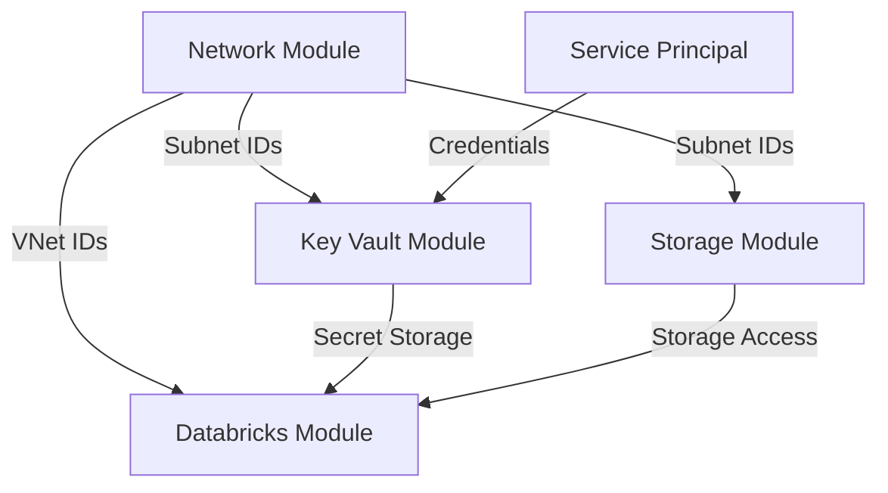

# Development Environment: Orchestrating the Complete Platform 🚀

Welcome to the Development environment configuration! This is where all our **individual modules come together** to create a complete, working data platform. Think of this as the **conductor of an orchestra** - each module is an instrument, and this environment brings them together in perfect harmony.

## 🎯 What Does This Environment Do?

This environment configuration:

1. **🎼 Orchestrates All Modules** - Brings network, storage, key vault, and databricks together
2. **🔐 Manages Service Principals** - Creates and configures secure authentication
3. **🏗️ Establishes Resource Hierarchy** - Sets up resource groups and dependencies
4. **🔗 Connects All Components** - Ensures seamless integration between modules
5. **📋 Provides Environment-Specific Values** - Tailored configuration for development

## 🏗️ Architecture Overview

```
                        🌐 INTERNET
                             │
                             ▼
                    ┌─────────────────┐
                    │ Azure Firewall  │ ← All traffic inspected
                    │   (Central)     │
                    └─────────┬───────┘
                              │
         ┌────────────────────┼────────────────────┐
         │                   │                    │
         ▼                   ▼                    ▼
    ┌─────────┐         ┌─────────┐         ┌─────────┐
    │   DEV   │         │   QA    │         │  PROD   │
    │ Spoke   │         │ Spoke   │         │ Spoke   │
    └─────────┘         └─────────┘         └─────────┘
         │
         ▼
┌─────────────────────────────────────────────────────────┐
│                DEV ENVIRONMENT                          │
│                                                         │
│  ┌─────────────┐  ┌─────────────┐  ┌─────────────┐     │
│  │  STORAGE    │  │ KEY VAULT   │  │ DATABRICKS  │     │
│  │             │  │             │  │             │     │
│  │ ┌─────────┐ │  │ ┌─────────┐ │  │ ┌─────────┐ │     │
│  │ │Finance  │ │  │ │Secrets  │ │  │ │Analytics│ │     │
│  │ │Marketing│ │  │ │Keys     │ │  │ │Workspace│ │     │
│  │ │Sales    │ │  │ │Certs    │ │  │ │VNet     │ │     │
│  │ └─────────┘ │  │ └─────────┘ │  │ │Injection│ │     │
│  └─────────────┘  └─────────────┘  │ └─────────┘ │     │
│         │               │          └─────────────┘     │
│         │               │                 │            │
│         └───────────────┼─────────────────┘            │
│                         │                              │
│               ┌─────────────────┐                      │
│               │ SERVICE         │                      │
│               │ PRINCIPALS      │                      │
│               │                 │                      │
│               │ • DBX SPN       │                      │
│               │ • Storage SPN   │                      │
│               │ • Automation    │                      │
│               └─────────────────┘                      │
└─────────────────────────────────────────────────────────┘
```

## 🧩 Configuration Breakdown

Let's walk through each part of the orchestration:

### 1. Provider Configuration 🔧

```hcl
terraform {
  required_providers {
    azurerm = {
      source  = "hashicorp/azurerm"
      version = "~> 4.35"
    }
    azuread = {
      source  = "hashicorp/azuread"
      version = "~> 2.0"
    }
    databricks = {
      source  = "databricks/databricks"
      version = "~> 1.0"
    }
  }
}
```

**Why Multiple Providers?**

- **`azurerm`** - Core Azure resources (VNets, storage, key vault)
- **`azuread`** - Azure Active Directory (service principals, apps)
- **`databricks`** - Databricks-specific resources (clusters, jobs)

### 2. Resource Group Foundation 🏗️

```hcl
resource "azurerm_resource_group" "infra" {
  name     = var.resource_group_names[var.environment]
  location = var.location
}
```

**Foundation First**

All resources live in this resource group, creating a **logical boundary** for:
- **Cost management** - Track spending per environment
- **Access control** - RBAC at resource group level
- **Resource lifecycle** - Deploy and destroy together

### 3. Service Principal Creation 👤

```hcl
# Create Databricks service principal
resource "azuread_application" "dbx_app" {
  display_name = "dbx-spn-dev"
}

resource "azuread_service_principal" "dbx_sp" {
  client_id = azuread_application.dbx_app.client_id
}

resource "azuread_application_password" "dbx_secret" {
  application_id = azuread_application.dbx_app.client_id
  end_date       = "2026-07-07T00:00:00Z"
}
```

**Security Through Service Principals**

- **No human credentials** in production systems
- **Automated authentication** for all services
- **Auditable access** with clear identity trail
- **Time-limited secrets** with rotation capability

### 4. Module Orchestration 🎼

#### Network Module (The Foundation)
```hcl
module "network" {
  source              = "../../modules/network"
  environment         = var.environment
  location            = var.location
  resource_group_name = var.resource_group_names[var.environment]
  hub_address_space   = "10.0.0.0/16"
  spoke_address_spaces = {
    dev  = "10.1.0.0/16"
    qa   = "10.2.0.0/16"
    prod = "10.3.0.0/16"
  }
}
```

**Network First Strategy**

- **Foundational layer** - Everything else depends on networking
- **Security perimeter** - Firewall protects all resources
- **Connectivity matrix** - Hub-spoke topology scales well

#### Storage Module (The Data Lake)
```hcl
module "storage" {
  source                      = "../../modules/storage"
  environment                 = var.environment
  location                    = var.location
  resource_group_name         = var.resource_group_names[var.environment]
  storage_account_name_prefix = "stcontosodata"
  domains                     = var.domains
  private_endpoint_subnet_ids = module.network.spoke_private_endpoint_ids
  storage_spn_object_id       = var.storage_spn_object_id
}
```

**Data Organization**

- **Domain-driven containers** - Finance, marketing, sales separated
- **Network integration** - Uses private endpoints from network module
- **Security model** - Service principal access control

#### Key Vault Module (The Secret Store)
```hcl
module "keyvault" {
  source                     = "../../modules/keyvault"
  environment                = var.environment
  location                   = var.location
  resource_group_name        = var.resource_group_names[var.environment]
  tenant_id                  = var.tenant_id
  kv_name_prefix             = "kv-contoso"
  private_endpoint_subnet_id = module.network.spoke_private_endpoint_ids[var.environment]
}
```

**Centralized Secret Management**

- **Single source of truth** for all secrets
- **Network secured** via private endpoints
- **RBAC enabled** for modern access control

#### Databricks Module (The Analytics Engine)
```hcl
module "databricks" {
  source              = "../../modules/databricks"
  org_prefix          = var.org_prefix
  environment         = var.environment
  location_short      = var.location_short
  workspace_name      = local.workspace_name
  location            = var.location
  resource_group_name = var.resource_group_names[var.environment]
  virtual_network_id  = module.network.spoke_vnet_ids[var.environment]
  public_subnet_name  = "WorkloadSubnet"
  private_subnet_name = "PrivateEndpointSubnet"
  databricks_spn_id   = azuread_application.dbx_app.client_id
  databricks_spn_secret = azuread_application_password.dbx_secret.value
  tenant_id           = var.tenant_id
}
```

**Analytics Platform**

- **VNet injection** - Secure network integration
- **Service principal auth** - Automated, secure access
- **Workspace naming** - Consistent across environments

### 5. Secret Storage 🔐

```hcl
# Store service principal credentials in Key Vault
resource "azurerm_key_vault_secret" "dbx_id" {
  name         = "databricks-spn-id"
  value        = azuread_application.dbx_app.client_id
  key_vault_id = module.keyvault.key_vault_id
}

resource "azurerm_key_vault_secret" "dbx_secret" {
  name         = "databricks-spn-secret"
  value        = azuread_application_password.dbx_secret.value
  key_vault_id = module.keyvault.key_vault_id
}
```

**Why Store in Key Vault?**

- **Centralized management** - One place for all secrets
- **Access control** - RBAC controls who can read secrets
- **Audit trail** - All access logged and monitored
- **Integration ready** - Other services can reference secrets

## 📊 Environment Variables

The environment is customized through variables defined in `terraform.tfvars`:

```hcl
# Environment identification
environment = "dev"
location    = "northeurope"
org_prefix  = "contoso"
location_short = "eun1"

# Resource organization
resource_group_names = {
  dev  = "rg-contoso-infra-dev"
  qa   = "rg-contoso-infra-qa"
  prod = "rg-contoso-infra-prod"
}

# Business domains for storage containers
domains = ["finance", "marketing", "sales"]

# Azure configuration
subscription_id = "a8260178-3b6d-4bce-a07e-3aae8c7a62af"
tenant_id = "b3680828-8bce-4405-9349-17844fcea2c9"
storage_spn_object_id = "77bbef09-a727-42a6-97d4-93ef3d13c94c"
```

**Environment-Specific Patterns**

- **Naming conventions** - Consistent across all resources
- **Network isolation** - Each environment gets own spoke
- **Shared configuration** - Same modules, different values

## 🔗 Inter-Module Dependencies

The magic happens in how modules connect to each other:



### Dependency Chain

1. **Network** creates VNets and subnets
2. **Storage** uses private endpoint subnets
3. **Key Vault** uses private endpoint subnets
4. **Databricks** uses spoke VNet for injection
5. **Service Principals** stored in Key Vault
6. **Databricks** authenticates with service principals

## 🎯 Deployment Workflow

### Initial Deployment

```bash
# 1. Navigate to environment
cd infra/envs/dev

# 2. Initialize Terraform
terraform init

# 3. Plan deployment
terraform plan -out=dev.tfplan

# 4. Review plan and apply
terraform apply dev.tfplan
```

### What Gets Created

After deployment, you'll have:

1. **Resource Group** - Container for all resources
2. **Service Principals** - Automated authentication
3. **Network Infrastructure** - Hub-spoke topology with firewall
4. **Storage Account** - Data lake with domain containers
5. **Key Vault** - Secure secret storage
6. **Databricks Workspace** - Analytics platform
7. **Private Endpoints** - Secure connectivity
8. **Route Tables** - Traffic control via firewall

## 🛡️ Security Implementation

### Network Security
- **Azure Firewall** inspects all traffic
- **Private endpoints** eliminate public exposure
- **VNet injection** keeps analytics traffic private

### Identity Security
- **Service principals** instead of user accounts
- **Time-limited secrets** with rotation capability
- **RBAC** for fine-grained access control

### Data Security
- **Domain isolation** via separate containers
- **Network restrictions** on storage accounts
- **Encryption** at rest and in transit

## 📈 Scaling Patterns

### Adding New Business Domains

```hcl
# In terraform.tfvars
domains = [
  "finance", 
  "marketing", 
  "sales",
  "hr",           # New domain
  "operations"    # New domain
]
```

### Adding New Environments

```hcl
# In spoke_address_spaces
spoke_address_spaces = {
  dev     = "10.1.0.0/16"
  qa      = "10.2.0.0/16"
  staging = "10.3.0.0/16"  # New environment
  prod    = "10.4.0.0/16"
}
```

## 🔍 Monitoring and Observability

### Key Metrics to Monitor

- **Network traffic** through Azure Firewall
- **Storage access patterns** via diagnostic logs
- **Key Vault access** for security monitoring
- **Databricks cluster utilization** for cost optimization

### Diagnostic Configuration

All resources have diagnostic settings enabled to send logs to:
- **Log Analytics** for centralized logging
- **Storage Account** for long-term retention
- **Event Hub** for real-time streaming

## 🎓 Learning Takeaways

1. **Environment orchestration** brings individual modules together
2. **Service principals** provide secure, automated authentication
3. **Module dependencies** create logical deployment order
4. **Network-first approach** establishes security foundation
5. **Domain-driven design** scales with business needs
6. **Private endpoints** eliminate public internet exposure

## 🔄 Next Steps

- **Deploy to QA** - Copy this pattern to `../qa/` directory
- **Add monitoring** - Implement Azure Monitor dashboards
- **CI/CD integration** - Automate deployments with pipelines
- **Cost optimization** - Implement resource tagging and budgets

## 🚨 Troubleshooting

### Common Issues

1. **Provider errors** - Ensure all required providers are declared
2. **Permission errors** - Check service principal has correct roles
3. **Network connectivity** - Verify private endpoint DNS resolution
4. **Secret access** - Confirm Key Vault access policies

### Debugging Commands

```bash
# Check Terraform state
terraform show

# Validate configuration
terraform validate

# Check provider status
terraform providers

# View specific resource
terraform state show module.network.azurerm_virtual_network.hub
```

This development environment showcases how modern infrastructure orchestration brings together security, networking, storage, and analytics into a cohesive, enterprise-ready platform! 🚀
